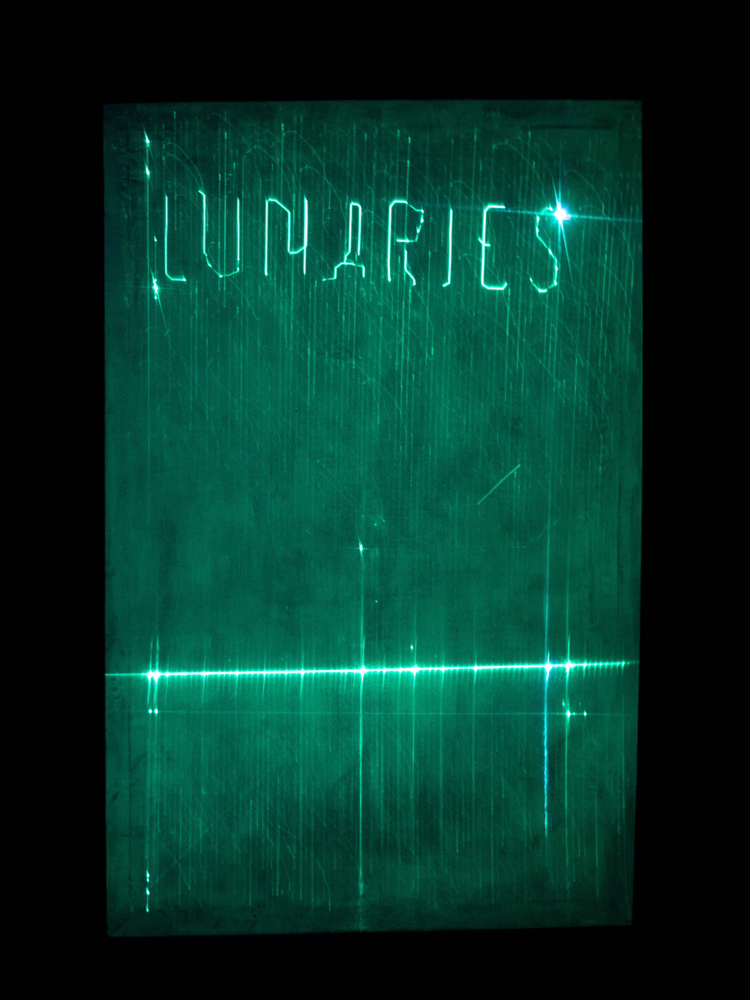
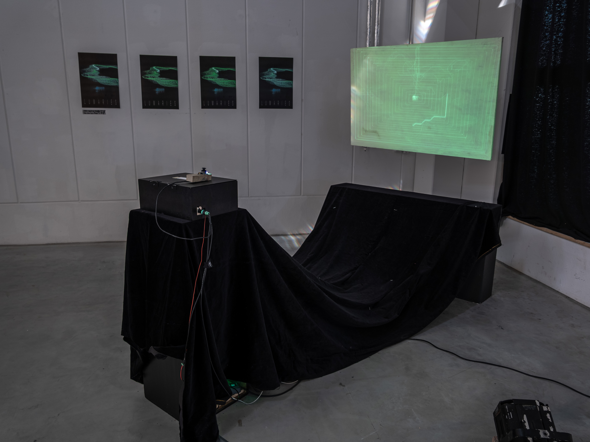
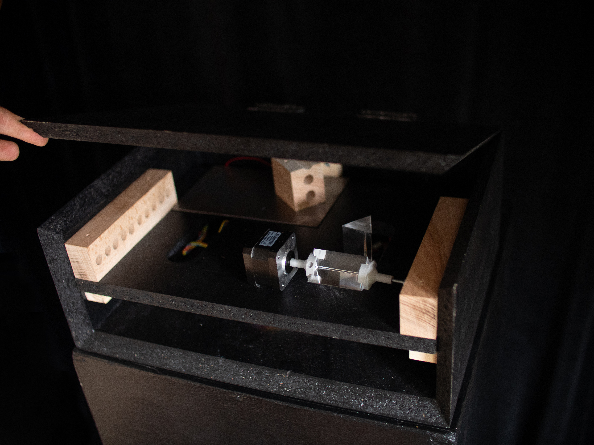
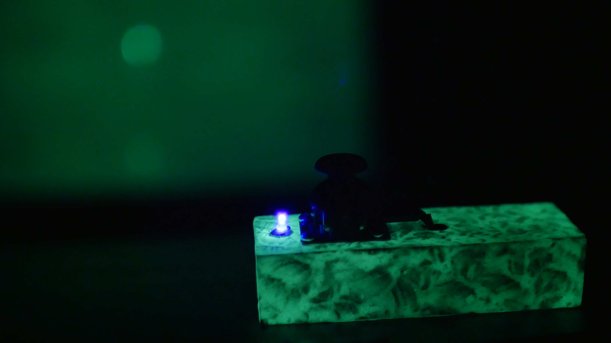
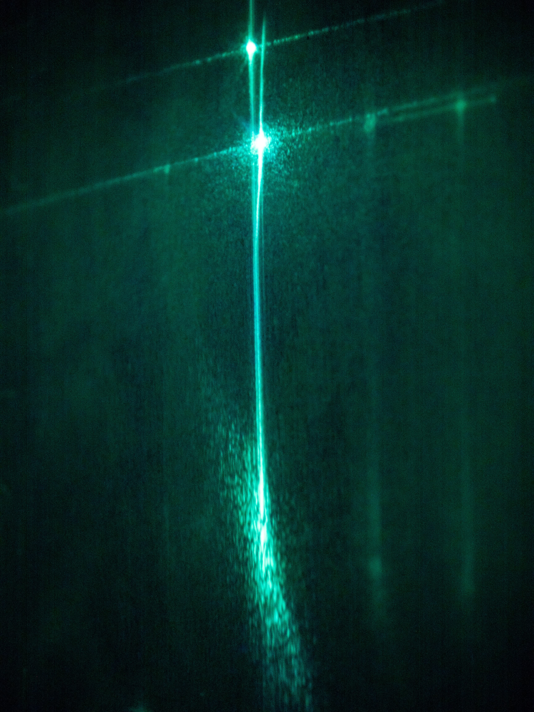
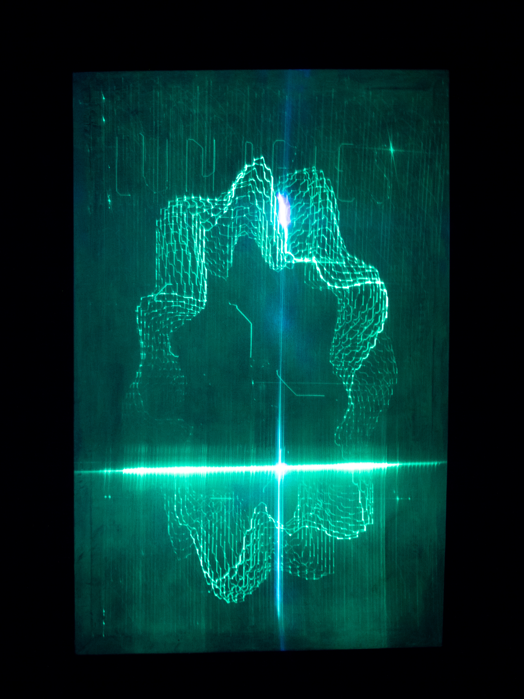

# Lumaries

Photo by Tim Redlich

Lumaries is an interactive installation built around the concepts of memories and interaction. Approaching, the observer will notice a moving laserdot on a screen that leaves a glowing trace behind. In front of the screen on a socket sits a wooden box:  **the projector** with a controller attached to it. Via this controller the observer can **interrupt** the laserdot and take control over its movements. As being interrupted those movements get **remembered**. As being left alone, the projector begins to **tell** those memories, drawing them out loud on the screen. Every time the story gets told, its path draws differently yet its essence remains. Over time those paths will average to a multitude of different **version of reality**.
The installation embodies both short and long term memory. The former by the memorability of the screen itself and the latter by the installation **recapitulating**  its memories over time.
A **halogen sun** it connected to the projector. After a while **sun will rise**, flooding the entire canvas with bright light. Clouds might cover it there are any today, but **no memories** are visible whatsoever. Only after sun has set the quiet drawing continues. The screen of course charged to the last corner but not to its full potential. Those last drawings that were made before todays dawn are still there. As if they were never gone.

[See the video of the Installation](https://www.youtube.com/watch?v=yPWX4nCJhSs)

### the screen

The screen is covered in a special paint made of a transparent acryl media mixed with a special pigment that phosphorises when exposed to uv light. The pigment will glow in a green tone for up to 60 minutes. 360 to 400nm wavelength is the optimal range. In the installation, a 405nm 5mW laser module was enough phosphorise the pigments to their full potential.
Halogen light however, while appearing much brighter to the human eye contains all kinds of wavelength but has mostly no effect to the pigment. The 5mW uv laser ultimately attains the pigments more than the 300W halogen spot. That's why a laser drawing is  visible on the screen even after being being exposed to strong halogen light.

### the projector

For the projector, a wooden box has been constructed to contain the microcontroller and two stepper motors. Each motor is mounted a prism, one vertically one horizontally, whose angles can therefore be controlled.

The uv laser module sits inside of a movable magnetic shoe on a steel plate. Its beam travels through the box towards the two prisms that act as movable mirrors to slightly change the x and y direction of the laser beam before it leaves the open front of the box in direction of the screen. A virtual coordinate system can be applied to the screen for the laser dot to live in.
The laser itself can be dimmed precisely or turned off via PWM Signals. It is a 5mW 405nm module. I tested stronger ones, but no enhanced visibility was noticable on short distance.

### the controler

The controler is a piece of wood, that is covered in the same phosphorescent color like the canvas. It holds a two-axis-thumbstick and a uv LED whose brightness level is synchronised to the laser. A jog on the thumbstick makes the stepper motors move within pre-set operational bounds.

### the sun

A 300W halogen spot acts as a sun, providing the installation with a second state: Daytime. The spot is connected to a dimmer that is being controlled by the microcontroller via DMX signals. Via software, the spot gets dimmed to simulate clouds of different sizes that cover the sun.

### the software

The whole installation runs from a single C++ sketch on the Arduino Mega 2560. The two stepper motors are driven through the **AccelStepper** library, and a short calibration maps the screen into a normalised **coordinate system**, so every point can be addressed as a fraction of the canvas rather than in raw motor steps. The laser is dimmed over **PWM** through a gamma curve for an even brightness response, while the halogen sun is reached by a hand-timed **DMX512** signal over RS485. The program is built as a state machine running in one continuous loop: a drawing routine blocks while it traces a shape but keeps listening for input, so a touch of the thumbstick can interrupt it at any moment. Gestures are held as sampled arrays of points in memory and played back with a added noise, and the generative motions — circles, spirals, rain — are all parametric, their character set by a handful of constants at the top of the code.

[Find the Code on GitHub](https://github.com/niezuhaus/Lumaries)

## intention and motivation

The nature of memories inspires me deeply. Working out an artistic concept towards it feels like an honest confrontation towards my own biography. The potential weight of memories became evident to me during the pandemic and taking the time to consciously let the processes of interpretation unfold has become a sanitising ritual ever since.

With my installaton, I try to create a noteworthy moment of connection for both me and the observer with the installation itself as with the observer before and after them. The screen is being drawn on collectively. Memories get created in the moment of performing the first gestures in this newly discovered world. Nothing stays forever yet nothing can be erased either. Isn't that what makes a memory? For me, this project is a diary, a dialog, an inner expression, a Déjà-vu, a microbiography, an archive of acquaintances.

As the core and foundation of personality, memories might scream loudly out of dissonance or quietly fade into indifferet realms, be absent in one moment or very close in another. Some might feel forgotten until their return at an unforseen occasion. We act as preservators of those biographical atoms. Our own as well as our adopted ones. The work is ultimately inspired by cultures of remembrance like they exist in many different forms worldwide, where memories get **passed on** to future generations as a part of a preservational culture.

